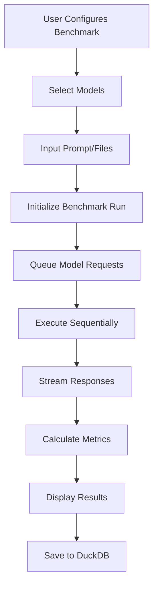

# HRA42 Bench - LLM Comparison Platform

## Complete Development Plan

---

## Executive Summary

HRA42 Bench is a streamlined SvelteKit application designed to benchmark Large Language Model (LLM) performance across multiple dimensions. It enables users to run benchmarks on various models simultaneously through OpenRouter's unified API, providing visual comparisons of responses, costs, and performance metrics.

### Key Features

- **Multi-modal Benchmarking**: Text, structured output, vision, and document processing
- **Simultaneous Comparison**: Benchmark multiple models with one request
- **Cost & Performance Tracking**: Real-time metrics and historical tracking
- **EU-First Technology**: Built with DuckDB for data persistence
- **Composable UI**: Fully Tailwind CSS with atomic component design

---

## Technical Architecture

### Technology Stack

- **Framework**: SvelteKit (Full-stack)
- **Database**: DuckDB (EU-based embedded database)
- **Styling**: Tailwind CSS (utility-first, no custom CSS)
- **Language**: TypeScript
- **API Integration**: OpenRouter (exclusive LLM provider)
- **File Handling**: Temporary processing for multimodal inputs

### Project Structure

```
hra42-bench/
├── src/
│   ├── routes/
│   │   ├── +layout.svelte           # Root layout
│   │   ├── +page.svelte              # Dashboard/home
│   │   ├── benchmark/
│   │   │   └── +page.svelte          # Main benchmarking interface
│   │   ├── history/
│   │   │   └── +page.svelte          # Historical results
│   │   └── api/
│   │       ├── models/
│   │       ├── execute/
│   │       └── results/
│   ├── lib/
│   │   ├── server/
│   │   │   ├── db/
│   │   │   │   ├── client.ts         # DuckDB connection
│   │   │   │   ├── schema.ts         # Table definitions
│   │   │   │   └── queries.ts        # Query functions
│   │   │   └── openrouter/
│   │   │       ├── client.ts         # API client
│   │   │       ├── types.ts          # Response types
│   │   │       └── pricing.ts        # Cost calculations
│   │   ├── components/
│   │   │   ├── atoms/                # Base components
│   │   │   ├── molecules/            # Composed components
│   │   │   ├── organisms/            # Complex sections
│   │   │   ├── templates/            # Page templates
│   │   │   └── layouts/              # Layout wrappers
│   │   ├── stores/
│   │   │   ├── benchmark.ts          # Benchmark configuration
│   │   │   ├── results.ts            # Result management
│   │   │   └── models.ts             # Model availability
│   │   ├── types/
│   │   │   ├── benchmark.ts          # Benchmark type definitions
│   │   │   ├── model.ts              # Model interfaces
│   │   │   └── response.ts           # Response types
│   │   └── utils/
│   │       ├── cn.ts                 # Class name utilities
│   │       └── format.ts             # Formatters
├── static/                            # Static assets
├── data/
│   └── hra42.duckdb                  # Database file
└── app.d.ts                          # App type definitions
```

---

## Component Architecture

### Design System Philosophy

- **Utility-First**: Every style is a Tailwind class
- **Composition Over Inheritance**: Small, focused components that combine
- **Consistency Through Constraints**: Use Tailwind's default scale
- **Responsive by Default**: Mobile-first approach

### Component Hierarchy

#### Atoms (Base Components)

```
atoms/
├── Button.svelte         # Variants: primary, secondary, ghost, danger
├── Input.svelte          # Text input with consistent styling
├── Card.svelte           # Container with padding/shadow
├── Badge.svelte          # Model/status indicators
├── Icon.svelte           # Icon wrapper component
├── Spinner.svelte        # Loading indicator
├── Avatar.svelte         # Model provider logos
└── Divider.svelte        # Section separator
```

#### Molecules (Composed Components)

```
molecules/
├── ModelSelector.svelte      # Multi-select with search
├── CostDisplay.svelte        # Formatted cost with trend
├── MetricCard.svelte         # Stat display card
├── PromptInput.svelte        # Enhanced textarea
├── FileUploader.svelte       # Drag-drop file input
├── ResponseTime.svelte       # Duration display
├── TokenCounter.svelte       # Usage visualization
└── StatusIndicator.svelte    # Execution status
```

#### Organisms (Complex Sections)

```
organisms/
├── BenchmarkConfigurator.svelte  # Benchmark type selection & config
├── ModelComparisonGrid.svelte    # Results grid layout
├── ResponseViewer.svelte          # Formatted response display
├── HistoryTable.svelte            # Sortable results table
├── CostBreakdown.svelte           # Cost visualization
├── BenchmarkRunner.svelte         # Execution progress
└── ModelResponseCard.svelte       # Complete result card
```

#### Templates (Page Compositions)

```
templates/
├── BenchmarkingInterface.svelte   # Main benchmark page structure
├── DashboardView.svelte           # Home page layout
└── HistoryView.svelte             # Results browser layout
```

### Tailwind Configuration

#### Color System

- **Primary**: Blue spectrum (`blue-500` to `blue-700`)
- **Success**: Green (`green-500`)
- **Warning**: Amber (`amber-500`)
- **Danger**: Red (`red-500`)
- **Neutral**: Slate (`slate-50` to `slate-900`)

#### Spacing Patterns

- **Cards**: `p-4 md:p-6`
- **Sections**: `py-8 md:py-12`
- **Component gaps**: `space-y-4` or `gap-4`
- **Inline spacing**: `space-x-2`

#### Responsive Breakpoints

- **Mobile**: Base styles
- **Tablet**: `md:` (768px)
- **Desktop**: `lg:` (1024px)
- **Wide**: `xl:` (1280px)

---

## Database Schema

### DuckDB Tables

**benchmark_runs**

- Core benchmark execution tracking
- Stores benchmark configuration and status
- Links to all related model responses

**model_responses**

- Individual model response data
- Performance metrics and costs
- Error states and metadata

**models**

- Cached model information
- Pricing and capability data
- Updated periodically from OpenRouter

**benchmark_templates**

- Reusable benchmark configurations
- Named templates for common benchmarks

---

## Core Features Implementation

### 1. Benchmark Types

#### Text Generation

- Simple prompt input
- Response comparison
- Token usage tracking

#### Structured Output

- JSON schema definition
- Schema compliance visualization
- Format validation display

#### Tool/Function Calling

- Function definition interface
- Call sequence display
- Parameter matching

#### Vision Analysis

- Image upload (drag & drop)
- Base64 encoding for API
- Visual response comparison

#### Document Processing

- PDF upload support
- Text extraction comparison
- Table/structure detection

### 2. Benchmark Execution Flow



### 3. Real-time Updates

- Server-Sent Events for progress
- Streaming response display
- Live cost calculation
- Progressive result rendering

### 4. Historical Analysis

- Trend detection over time
- Model performance changes
- Cost efficiency tracking
- Response quality shifts

---

## User Interface Flow

### Main Benchmarking Interface

#### Layout Structure

```
┌─────────────────────────────────────┐
│         Navigation Bar              │
├─────────────────────────────────────┤
│  Benchmark Configuration            │
│  ┌─────────────────────────────┐   │
│  │ [Text] [JSON] [Tool] [Image]│   │
│  └─────────────────────────────┘   │
│  ┌─────────────────────────────┐   │
│  │ Model Selection              │   │
│  │ □ GPT-4  □ Claude  □ Gemini │   │
│  └─────────────────────────────┘   │
│  ┌─────────────────────────────┐   │
│  │ Input Area                   │   │
│  └─────────────────────────────┘   │
│  [Execute Benchmark]                │
├─────────────────────────────────────┤
│  Results Comparison                 │
│  ┌──────┐ ┌──────┐ ┌──────┐       │
│  │Model1│ │Model2│ │Model3│       │
│  │Result│ │Result│ │Result│       │
│  └──────┘ └──────┘ └──────┘       │
└─────────────────────────────────────┘
```

### Responsive Behavior

- **Mobile**: Stack components vertically
- **Tablet**: 2-column grid for results
- **Desktop**: 3-4 column grid for results

---

## Implementation Phases

### Phase 1: Foundation (Week 1) ✅

- [x] SvelteKit project setup
- [x] Tailwind CSS configuration
- [x] DuckDB integration (using new @duckdb/node-api)
- [x] Basic component library (atoms)
- [x] OpenRouter client setup
- [x] Database schema creation

### Phase 2: Core Benchmarking (Week 2) ✅

- [x] Text generation benchmarking
- [x] Model selection interface
- [x] Benchmark execution pipeline
- [x] Real-time progress updates
- [x] Basic result display
- [x] Cost calculation

### Phase 3: UI Components (Week 3)

- [x] Complete molecule components
- [x] Organism components
- [x] Page templates
- [x] Responsive layouts
- [x] Loading states
- [x] Error handling
- [x] Dark Mode

### Phase 4: Advanced Benchmarks (Week 4)

- [x] Structured output benchmarking
- [x] Function calling benchmarks
- [ ] Image upload and processing
- [ ] PDF handling
- [ ] Multi-modal comparisons

### Phase 5: Analytics & Polish (Week 5)

- [ ] Historical data views
- [ ] Trend analysis
- [ ] Export functionality
- [ ] Performance optimization
- [ ] UI refinements
- [ ] Documentation

---

## Technical Implementation Details

### OpenRouter Integration

#### Client Configuration

- API key management
- Base URL configuration
- Timeout settings
- Retry logic for failures

#### Request Handling

- Rate limiting per model
- Automatic retry logic
- Error categorization
- Streaming support

### File Processing

#### Image Handling

- Accept: JPEG, PNG, WebP
- Max size: 20MB (configurable)
- Base64 encoding for API
- Preview generation

#### PDF Processing

- Text extraction
- Page limit handling
- Structure preservation
- Error recovery

### Performance Optimizations

#### Frontend

- Lazy loading for history
- Virtual scrolling for large lists
- Debounced search inputs
- Memoized expensive computations

#### Backend

- Cached model information
- Batch insert for results
- Indexed queries

---

## Development Workflow

### Environment Setup

- Development server with hot reload
- Database initialization scripts
- Migration support for schema changes
- Production build process

### Environment Variables

- `OPENROUTER_API_KEY` - Your OpenRouter API key (required)
- `OPENROUTER_BASE_URL` - API base URL (optional, defaults to `https://openrouter.ai/api/v1`)
- `DATABASE_PATH` - DuckDB database file location (optional, defaults to `data/hra42.duckdb`)
- `PUBLIC_APP_NAME` - Application name for branding (optional)

---

## Deployment Considerations

### Self-Hosted Deployment

- Single Docker container
- Volume mount for DuckDB
- Environment variable configuration
- Health check endpoint

## Success Metrics

### Technical Goals

- Sub-second page loads
- Real-time streaming responses
- Zero data loss

### User Experience Goals

- Intuitive benchmark configuration
- Clear result comparison
- Accurate cost tracking
- Useful historical insights

---

## Conclusion

HRA42 Bench provides a focused, efficient solution for comparing LLM performance across multiple dimensions. By leveraging SvelteKit's full-stack capabilities, DuckDB's analytical power, and Tailwind's utility-first approach, we create a maintainable, performant application that delivers immediate value for LLM evaluation and selection.
