# Architecture Documentation

## System Overview

HRA42 AI Bench is built as a full-stack web application using SvelteKit, providing a unified platform for benchmarking Large Language Models through OpenRouter's API.

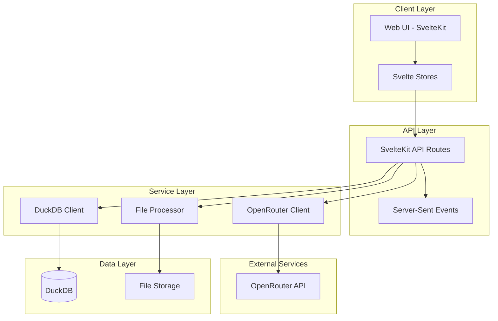

## Component Architecture

### Frontend Architecture

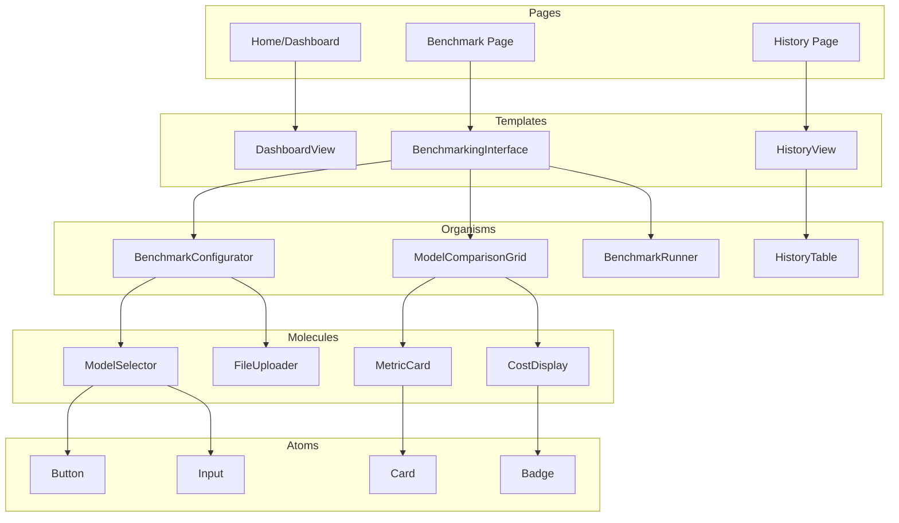

### Backend Architecture

```mermaid
graph LR
    subgraph "API Routes"
        Models[/api/models]
        Execute[/api/execute]
        Results[/api/results]
        Export[/api/export]
    end

    subgraph "Services"
        ModelService[Model Service]
        BenchmarkService[Benchmark Service]
        ResultService[Result Service]
        ExportService[Export Service]
    end

    subgraph "Data Access"
        DBClient[DuckDB Client]
        ORClient[OpenRouter Client]
    end

    Models --> ModelService
    Execute --> BenchmarkService
    Results --> ResultService
    Export --> ExportService

    ModelService --> ORClient
    ModelService --> DBClient
    BenchmarkService --> ORClient
    BenchmarkService --> DBClient
    ResultService --> DBClient
    ExportService --> DBClient
```

## Data Flow

### Benchmark Execution Flow

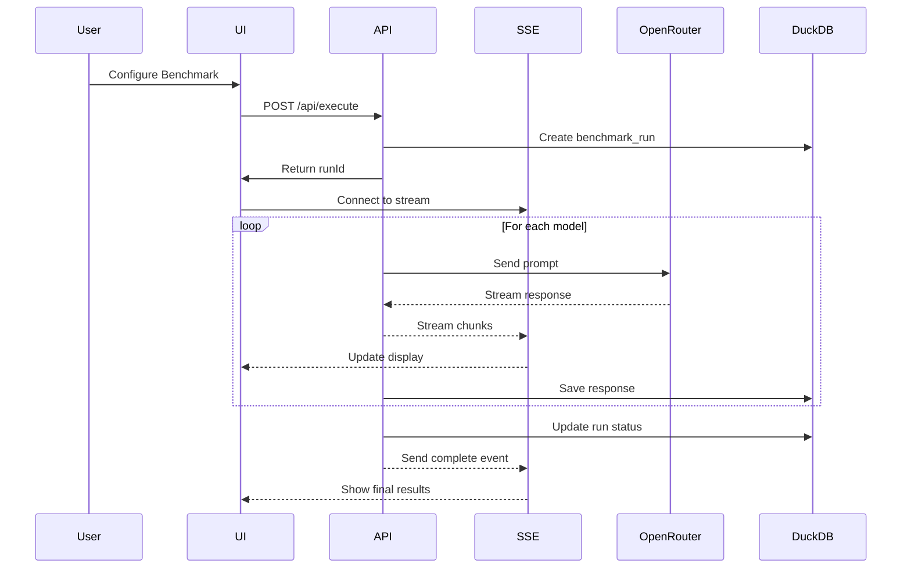

### File Processing Flow

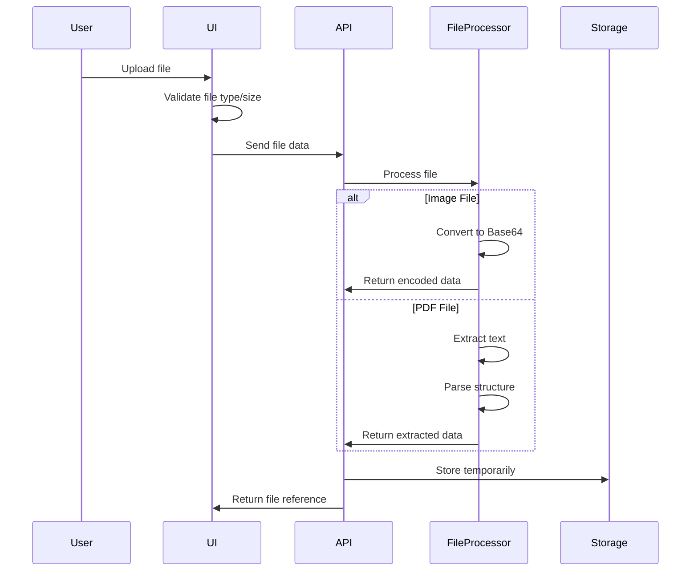

## Database Schema

### Entity Relationship Diagram

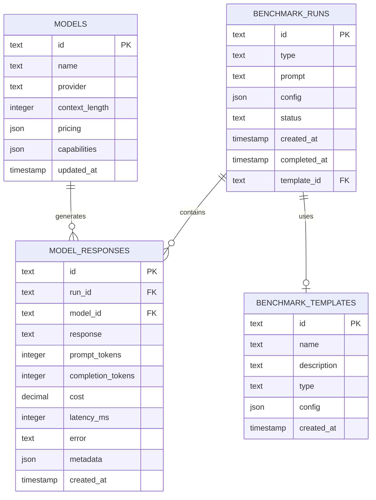

### Table Details

#### benchmark_runs

- **Purpose**: Track benchmark execution sessions
- **Indexes**: `created_at`, `type`, `status`
- **Partitioning**: Monthly by `created_at`

#### model_responses

- **Purpose**: Store individual model responses and metrics
- **Indexes**: `run_id`, `model_id`, `created_at`
- **Constraints**: Foreign key to `benchmark_runs`

#### models

- **Purpose**: Cache model information from OpenRouter
- **Indexes**: `provider`, `updated_at`
- **Update frequency**: Daily

#### benchmark_templates

- **Purpose**: Store reusable benchmark configurations
- **Indexes**: `type`, `created_at`

## State Management

### Store Architecture

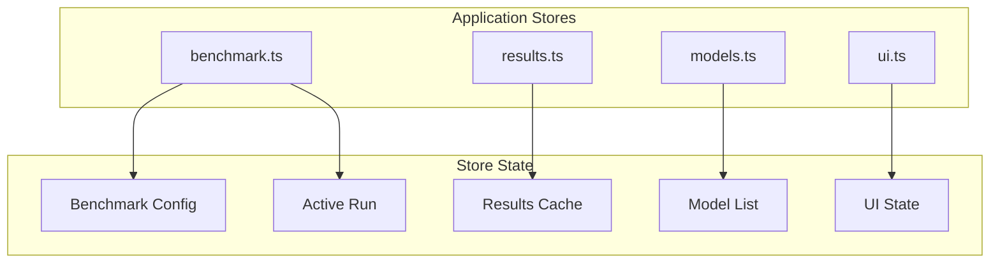

### State Flow

```typescript
// Benchmark configuration flow
benchmarkStore.set({
  type: 'text',
  models: ['gpt-4', 'claude-3'],
  prompt: 'Test prompt',
  config: { temperature: 0.7 }
})
↓
// Execution triggers
resultStore.startRun(runId)
↓
// Real-time updates
resultStore.updateModelResponse(modelId, chunk)
↓
// Completion
resultStore.completeRun(summary)
```

## Security Architecture

### Authentication & Authorization

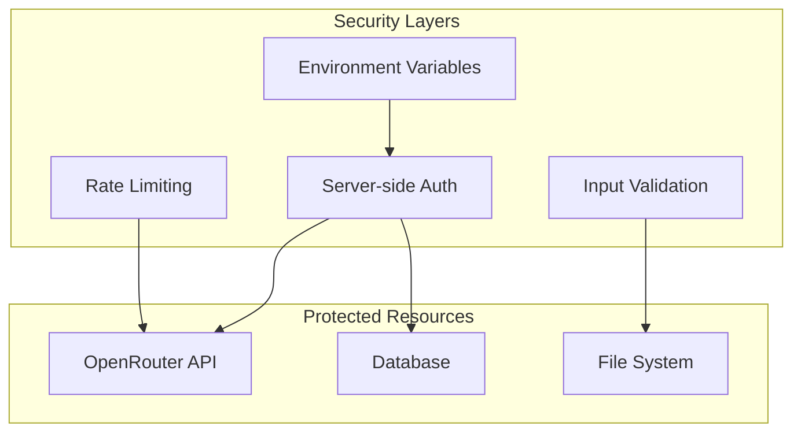

### Security Measures

1. **API Key Management**
   - Server-side only storage
   - Environment variable configuration
   - Never exposed to client

2. **Input Validation**
   - File type restrictions
   - Size limitations (20MB default)
   - Schema validation for structured inputs

3. **Rate Limiting**
   - Per-IP rate limiting
   - Model-specific limits
   - Exponential backoff

4. **Data Privacy**
   - Local database storage
   - No external data transmission
   - Temporary file cleanup

## Performance Optimization

### Caching Strategy

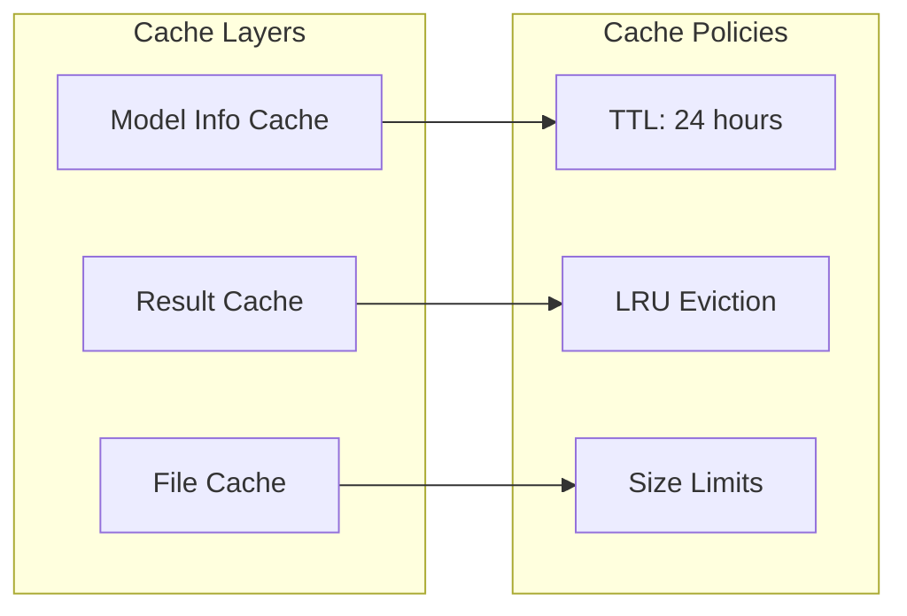

### Optimization Techniques

1. **Frontend Optimizations**
   - Lazy loading for history
   - Virtual scrolling for large lists
   - Debounced search inputs
   - Component code splitting

2. **Backend Optimizations**
   - Batch database operations
   - Connection pooling
   - Streaming responses
   - Efficient query indexing

3. **Network Optimizations**
   - Server-Sent Events for real-time updates
   - Compression for API responses
   - CDN for static assets
   - HTTP/2 support

## Deployment Architecture

### Container Architecture

```dockerfile
# Multi-stage build
FROM node:20-alpine AS builder
WORKDIR /app
COPY package*.json ./
RUN npm ci
COPY . .
RUN npm run build

FROM node:20-alpine
WORKDIR /app
COPY --from=builder /app/build ./build
COPY --from=builder /app/package*.json ./
RUN npm ci --production
EXPOSE 3000
CMD ["node", "build"]
```

### Deployment Options

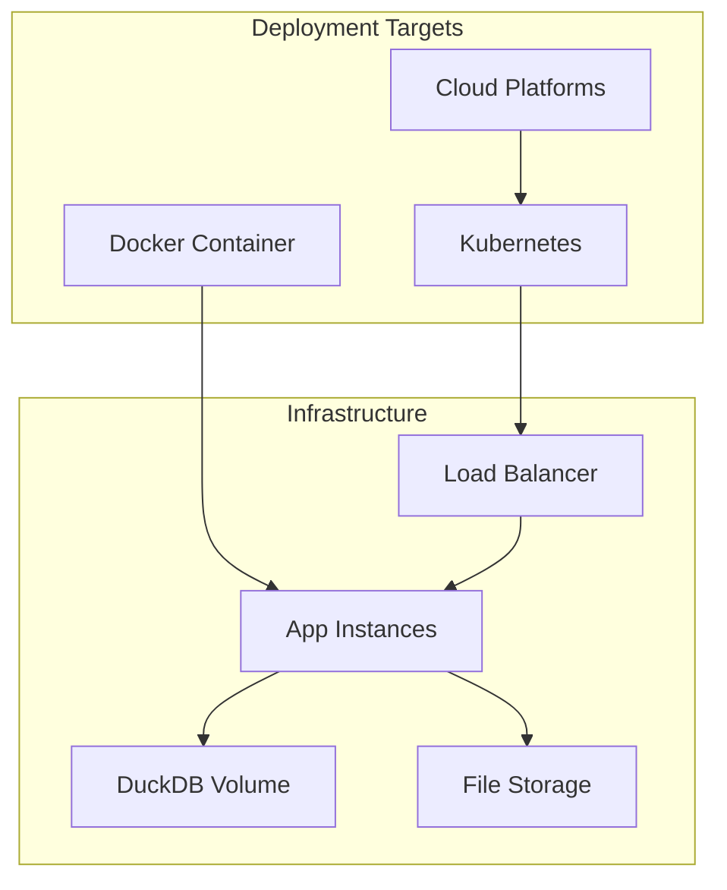

## Monitoring & Observability

### Metrics Collection

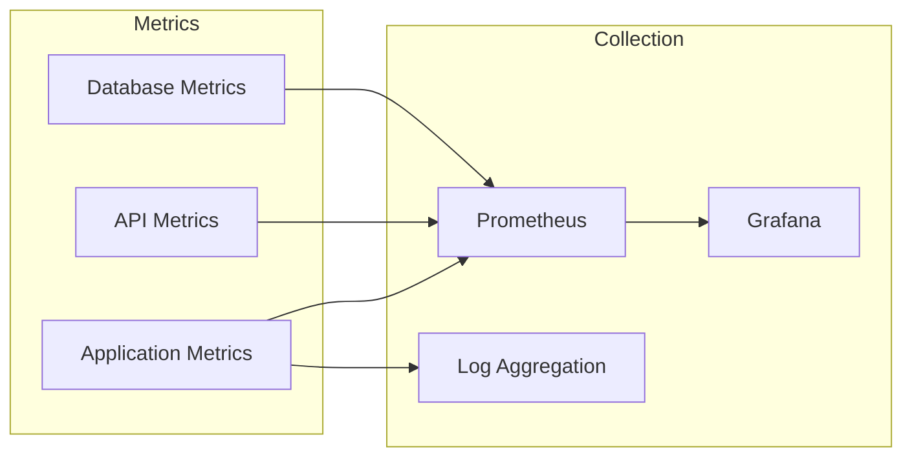

### Key Metrics

1. **Application Metrics**
   - Request rate
   - Response time
   - Error rate
   - Active users

2. **Benchmark Metrics**
   - Execution time
   - Success rate
   - Model performance
   - Cost per run

3. **System Metrics**
   - CPU usage
   - Memory usage
   - Disk I/O
   - Network traffic

## Scalability Considerations

### Horizontal Scaling

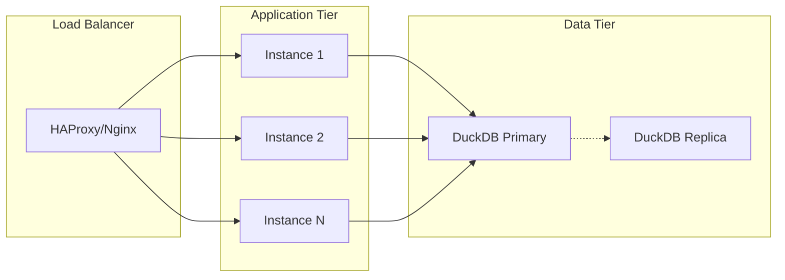

### Scaling Strategies

1. **Application Scaling**
   - Stateless design
   - Session affinity for SSE
   - Shared file storage
   - Database connection pooling

2. **Database Scaling**
   - Read replicas
   - Query optimization
   - Index management
   - Partitioning strategy

3. **API Scaling**
   - Rate limiting
   - Request queuing
   - Caching layer
   - CDN integration

## Technology Decisions

### Why SvelteKit?

- **Full-stack framework**: API routes + UI in one
- **Performance**: Compiled, no virtual DOM
- **Developer experience**: Simple, intuitive API
- **TypeScript**: First-class support
- **SSR/SSG**: Flexible rendering options

### Why DuckDB?

- **Embedded database**: No separate service
- **OLAP optimized**: Perfect for analytics
- **SQL interface**: Familiar querying
- **Performance**: Columnar storage, vectorized execution
- **Portability**: Single file database

### Why Tailwind CSS?

- **Consistency**: Design system constraints
- **Performance**: PurgeCSS removes unused styles
- **Maintainability**: No custom CSS to manage
- **Responsive**: Mobile-first utilities
- **Customization**: Easy theming

### Why OpenRouter?

- **Unified API**: Single integration for all models
- **Model variety**: Access to 100+ models
- **Pricing transparency**: Clear cost structure
- **Reliability**: Built-in fallbacks
- **Features**: Streaming, function calling support

## Future Architecture Considerations

### Planned Enhancements

1. **Microservices Migration**
   - Separate benchmark executor service
   - Independent result processor
   - Dedicated export service

2. **Event-Driven Architecture**
   - Message queue for benchmark jobs
   - Event sourcing for audit trail
   - WebSocket for real-time updates

3. **Advanced Analytics**
   - Time-series database for metrics
   - ML-based quality scoring
   - Automated benchmark recommendations

4. **Multi-tenancy**
   - User authentication system
   - Organization management
   - Role-based access control
   - Usage quotas

5. **Plugin System**
   - Custom benchmark types
   - Model provider plugins
   - Export format plugins
   - UI theme plugins
